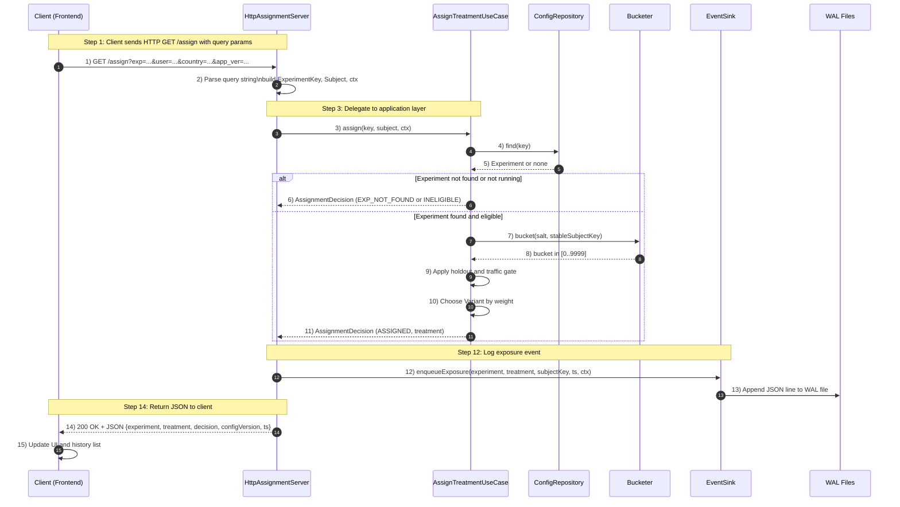

# On‑Box A/B Testing Daemon (Java) — Centralized Functional Spec

# AB Testing Daemon

A lightweight, deterministic, file‑driven A/B testing daemon with:
- Hot‑reload configuration
- Deterministic hashing (bucketing)
- Traffic & holdout gating
- Targeting rules (country, app version)
- Durable exposure logging using WAL
- Simple HTTP API (`/health`, `/assign`)
- Minimal HTML/JS frontend
- Clean architecture (domain → application → infra)


## Purpose & Scope

A lightweight Java service that runs on the same host/pod as your application to provide on‑box A/B experiment assignment, owner‑controlled traffic allocation, and reliable event logging (exposures & goals) with operational guardrails.

# Features

## Deterministic User Assignment
Users are assigned to variants based on:
- `salt`
- stable subject identity (`userId`, `deviceId`, or `requestId`)
- weighted variants
- traffic and holdout settings

## Hot Reload Config
`RefreshingFileConfigRepository` monitors `config.json`.
When the file changes:
- reloads config
- revalidates experiments
- swaps an immutable snapshot
- increments config version

No daemon restart required.

## Targets & Eligibility
Supports optional rules:
- Allowed countries
- Minimum app version
- Start/end date
- Status: `running`, `draft`, `paused`

## Durable WAL Logging
Every exposure event is written to:
```
wal/events-YYYYMMDD-HHMMSS-#.wal
```

Append-only NDJSON lines ensure:
- crash safety
- replayability
- simple analysis

Optional `fsync` for stricter durability.

##  Simple Frontend
`frontend/index.html` + JS app:
- shows daemon health
- sends assign requests
- displays treatment, decision, configVersion
- maintains a history list


# Project Structure

```
/src
  /domain         -> Experiment, Variant, Targets, Subject, AssignmentDecision
  /application    -> AssignTreatmentUseCase, Bucketer, Ports
  /infrastructure
      /config     -> RefreshingFileConfigRepository + Jackson loader
      /logging    -> WalEventSink
      /server     -> HttpAssignmentServer
      Main.java   -> Daemon entrypoint

/frontend
  index.html
  app.js
  styles.css

config.json        -> Experiment definitions
ab-daemon.env      -> .env-style config (gitignored)
wal/               -> Write-Ahead Log output
```


# Workflow Diagram
