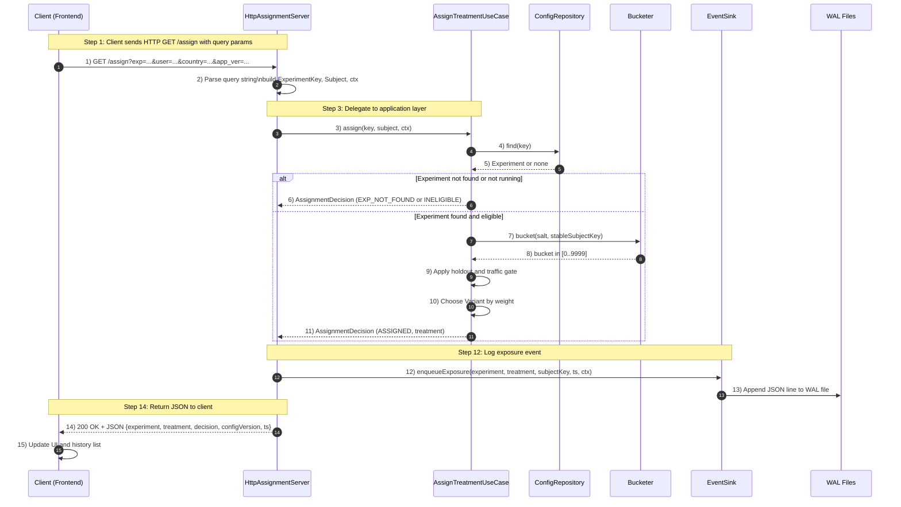

# On‑Box A/B Testing Daemon (Java) — Centralized Functional Spec

## Purpose & Scope

A lightweight Java service that runs on the same host/pod as your application to provide on‑box A/B experiment assignment, owner‑controlled traffic allocation, and reliable event logging (exposures & goals) with operational guardrails.

## Functional-Requirements

- Sub‑millisecond assignment via gRPC over Unix Domain Socket (UDS)
- Owner‑defined % allocation per treatment (branch), hot‑reloaded config
- Sticky per‑subject assignments without central storage
- Durable exposure/goal logging with batch shipping
- First‑class observability (metrics, health, SRM)
- Safe, minimal operational footprint (systemd/K8s sidecar)

## Non - Functional Requirement 

- Statistical analysis or experiment decisioning (happens downstream)
- UI for editing experiments (config produced by CI/ops)

## High Level Architecture 

- Control Plane: versioned, signed configs (JSON/Proto) in S3/GCS/HTTP.
- On‑Box Daemon (Java 21): Netty gRPC on UDS, in‑RAM config, assigner, event queue + WAL, shipper, /metrics & /health.
- Analytics Sink: Kafka/Kinesis/S3 (pluggable) for offline analysis & dashboards. 

**Data Path (Request)**: App → Assign() → Daemon → variant → App renders → App LogExposure() → later LogGoal() → Daemon batches → Sink.

## Core Functionalities 

1. Config Management

    - Periodic pull (5–30s) with ETag/version check
    - Schema + semantic validation (weights sum, time windows, targets)
    - Signature verification (optional) and atomic hot‑swap
    - Tracks and emits config_version & config_age_seconds

2. Owner‑Controlled Traffic Allocation
    - Owner sets weights per treatment and traffic cap in config
    - Optional per‑segment overrides and time‑based rollout schedule
    - QA overrides (force treatment for test users) with validation

3. Sticky Assignment 
    - Subject identity: user_id ▸ fallback device_id ▸ fallback request_id
    - Deterministic bucket via hash(salt + subject_key) → map to weighted ranges
    - Traffic gate & eligibility checks (targets, window, holdout) before assignment

4. Event Logging & Durability
    - In‑memory bounded queue + Write‑Ahead Log (WAL) on disk
    - Batch shipper to sink with exponential backoff & dead‑letter policy
    - Exactly‑once enqueue semantics within the daemon process

5. Observability & Guardrails
    - Prometheus metrics: latency histograms, per‑variant counts, queue depth, shipper status, config staleness, SRM χ²
    - Health endpoints: liveness/readiness; degraded when stale config/backlog
    - Kill‑switches: global force‑control, per‑experiment pause

6. Security & Hardening

    - Non‑root user, strict FS perms on UDS (/var/run/ab.sock), read‑only root, whitelisted state dirs
    - Optional config signing (Ed25519) and WAL at‑rest encryption
    - PII minimization: hashed IDs, redaction map for context fields

## How to test this ? 

Refer `testing.md` :)

## Workflow Diagram 

